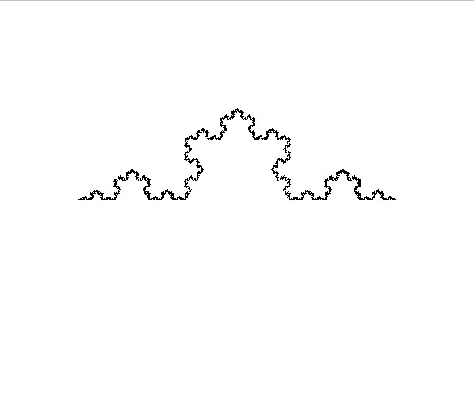
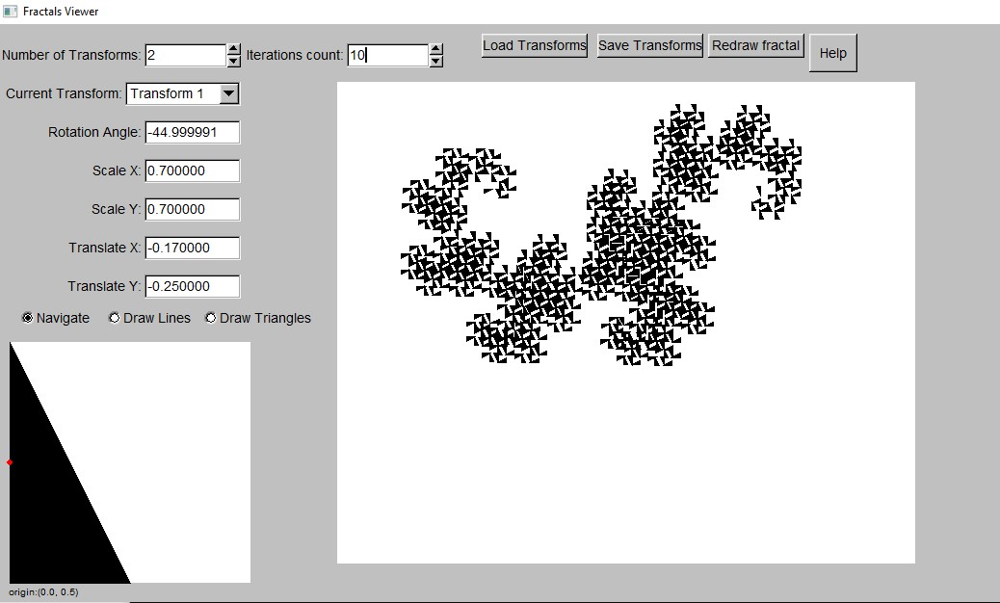
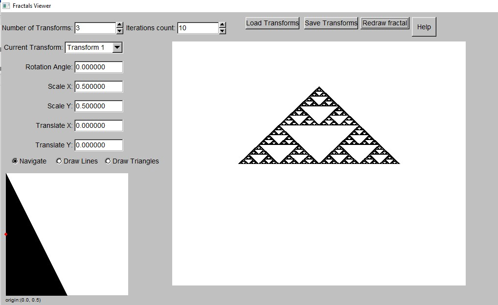
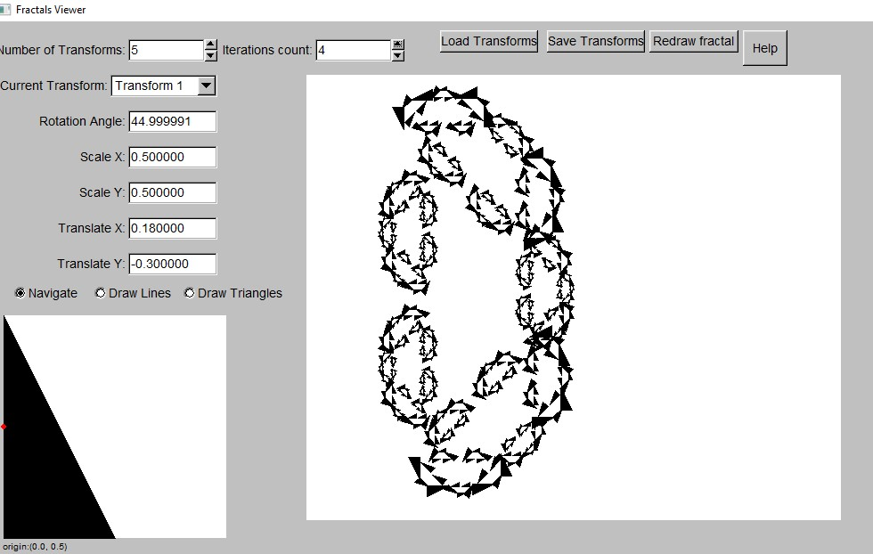

# SimpleFractalsViewer
This is simple fractals viewer. With it you can see (and construct) some of fractals.

This program is based in part on the work of the FLTK project (http://www.fltk.org).

In program you can define transformations and starting figure.
Program by transformations will create new figures from starting figure, remove starting figure and then look at created figures as at starting figure. Then program by transformations will create new figures from starting figure and remove starting figure...
Program will do these actions number of times equal to iterations parameter.

In other words, we can say, that program allows user to construct iterated funciton systems for case when we have not big amount of functions and when all function are 2d transformations (which could be represented through rotation, translation and scale properties).

For futher help on how to use program, run program and press 'Help'.

_I would like to thank Gintautas Bareikis for the information on how iterated function systems work and how to implement 2D transformations._

# How to compile program
If you have windows operating system and minGW64 compiler, you can try to run file 'createExe.bat'.

# Some pictures
### Koch curve:

### Dragon curve:

### Serpinski triangle:

### Constructed by me fractal, which looks similar to letter 'D':

